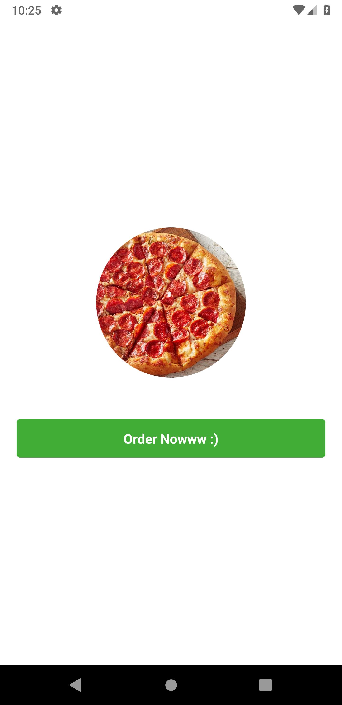
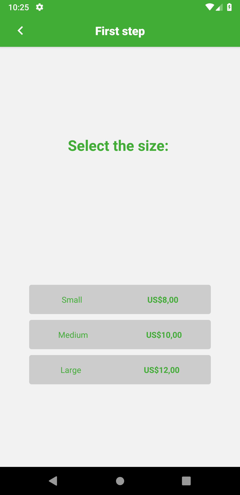
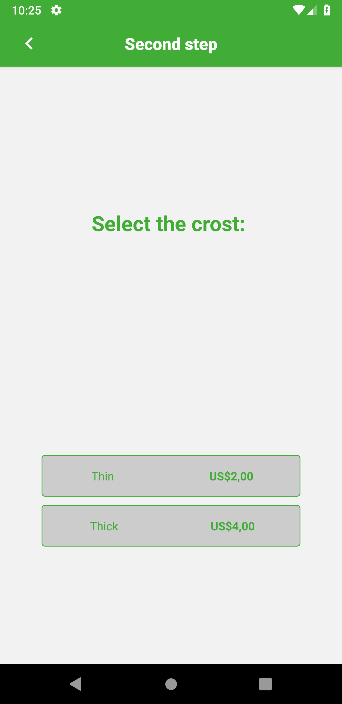
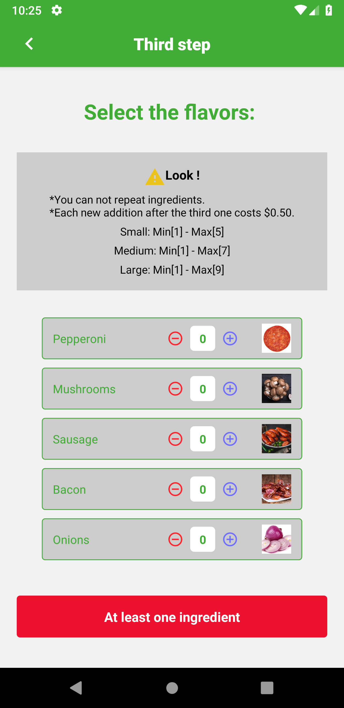
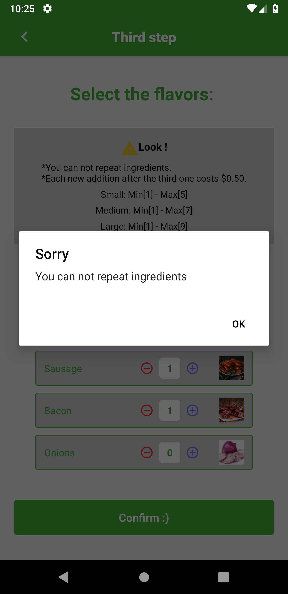
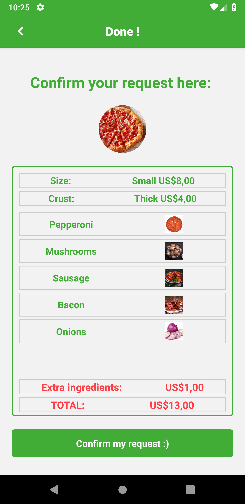
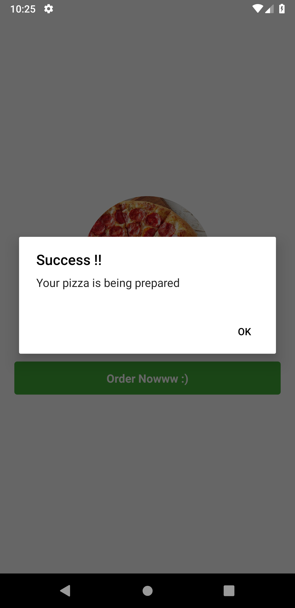

<h1>Making Pizza</h1>

<h4>This project was made with reactNative and typeScript</h4>

<i>GettingStarted</i>

1: Open the project and first of all run the json-server with the followind line: 
 
<i>npx json-server --host [YOUR HOST INFORMATION HERE. Ex: 192.168.0.12] server.json -p 3333 -w </i>  

2: react-native run Android
 

3: react-native start
  

  
  
  
   

 

  
  
  

